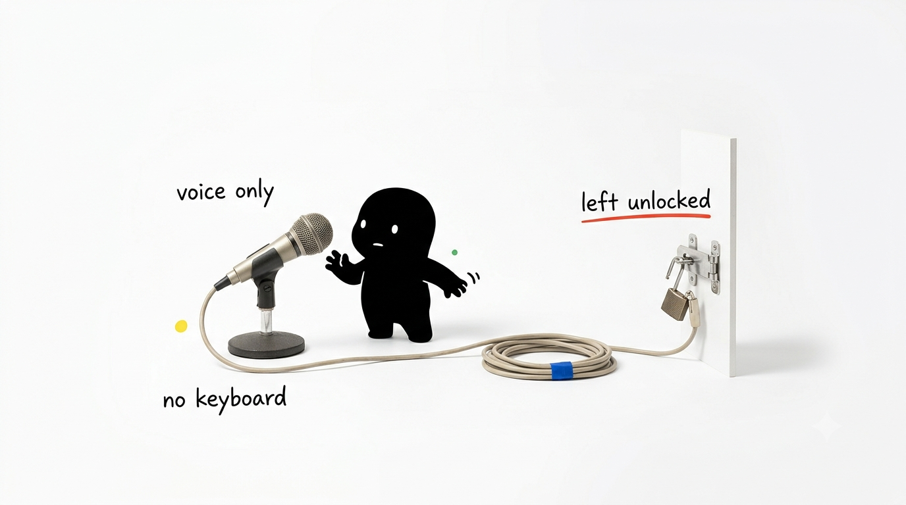
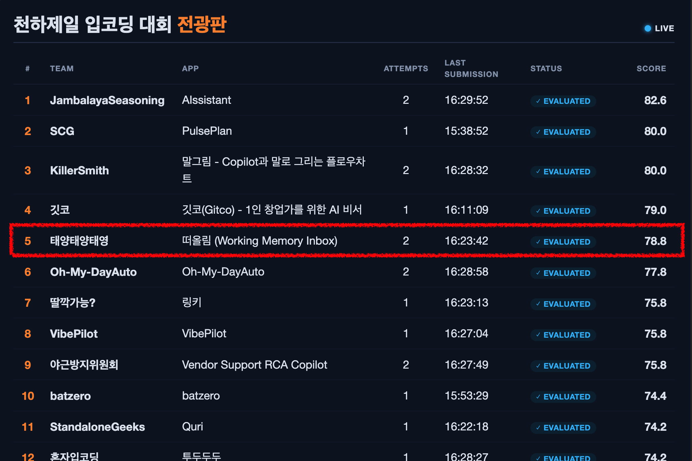

# Tteoolim: Working Memory Inbox

A production-grade mobile-first web application designed for high-cognitive-load idea capture and background triage. This repository acts as an engineering journal, documenting architectural decisions, real-world constraints during the **LipCoding 2026** hackathon, and subsequent post-competition production hardening.

## 🚀 The Challenge & Constraints



[LipCoding 2026](https://lipcoding.kr/) was an intensive 8-hour hackathon themed *"Code Without Barrier."*

**The Core Constraint:** Zero keyboard or mouse inputs allowed. All actions—code editing, terminal commands, version control, and PR descriptions—were executed exclusively via voice integration with the GitHub Copilot SDK.

This constraint served as a stress test for end-to-end AI autonomy versus human architectural direction: *Where does AI accelerate execution, and where does human engineering judgment remain the critical bottleneck?*


## 🛠️ Core Architecture & Tech Stack

**Tteoolim** (떠올림, *lit. "to surface / recall"*) optimizes human focus by acting as an intelligent asynchronous inbox. It captures raw ideas, automatically filters them into immediate tasks (Inbox) versus unstructured dumps (Dump), enriches low-context data via background workers, and surfaces actionable insights only when cognitive load is low.

### Technology Blueprint

| Layer | Technologies Leverage |
| --- | --- |
| **Frontend** | React 19, Vite 6, Tailwind CSS v4, TypeScript |
| **Backend** | FastAPI, Pydantic v2, Server-Sent Events (SSE) streaming |
| **AI Integration** | GitHub Copilot SDK, Azure OpenAI (`gpt-4o` via Azure AI Foundry) |
| **Data & Storage** | SQLite, Azure Files (Persistent Volume Mounts) |
| **Infrastructure** | Azure Container Apps (ACA), ACR, Azure Key Vault, Bicep IaC, UAMI |

> **Architectural Note:** AI interactions bypass fragile single-shot prompting. Instead, they implement a resilient **Session + Tool-Calling + Asynchronous Streaming** pattern. Detailed specifications are available in [`docs/architecture.md`](docs/architecture.md).


## 📊 Performance Metrics & Post-Mortem

### Hackathon Evaluation



> Final Score: 78.8, 5th grade on Leaderboard

| Assessment Criterion | Score |
| --- | --- |
| Effective Use of Copilot SDK | 4 / 5 |
| Productivity Impact & Problem Fit | 4 / 5 |
| Azure AI & Cloud Integration | 4 / 5 |
| Functionality & Technical Execution | 4 / 5 |
| User Experience & Workflow Design | 4 / 5 |
| **Responsible AI, Security & Trust** | **3 / 5** |

### 🔍 Engineering Retrospective (Honest Account)

While the core product loop functioned seamlessly under voice constraints, the time-boxed environment exposed critical areas for improvement:

1. **Security Technical Debt:** Security was initially treated as a fast-follow. The MVP lacked authentication and robust input sanitization, relying implicitly on LLM tool schemas for guardrails. delegating security prioritization to the AI under tight deadlines resulted in feature-creep over critical infrastructure hardening.
2. **Shallow Agentic Orchestration:** The hackathon implementation sequence used sequential tool-calling rather than a true multi-turn autonomous agentic loop.
3. **Deployment Friction:** Relying on real-time AI recommendations for infrastructure orchestration caused configuration drift. Pre-configured Bicep templates would have prevented significant deployment overhead.

*For a granular breakdown of these trade-offs, read the [`docs/RECALL.md`](docs/RECALL.md).*


## 🔧 Production Hardening: v0.0.2 Re-implementation

Using the judging criteria as a rigorous development backlog, I refactored the application post-competition to meet production-grade standards:

* **Zero-Trust Security & Auth:** Implemented secure passphrase authentication with signed `HttpOnly` session cookies, protected via custom FastAPI middleware across all `/api/*` routes.
* **Prompt Injection Defense (`app/prompt_guard.py`):** Built a deterministic sanitization pipeline utilizing NFKC normalization, control-character stripping, delimiter neutralization, and bilingual override pattern detection.
* **Enterprise Secret Management:** Migrated all configurations to User-Assigned Managed Identity (UAMI) with Azure Key Vault RBAC, entirely eliminating plaintext secrets and ACR admin credentials.
* **True Multi-Turn Tooling:** Integrated the Tavily API into the Copilot SDK layer, enforcing an autonomous sequence: *Web Search ➔ Context Synthesis ➔ Structured Option Framing*.
* **Resilient Data Patterns:** Replaced hard deletes with soft-delete tombstoning paired with a 10-second transactional rollback (Undo) UI state.
* **Infrastructure as Code (IaC):** Expanded `infra/main.bicep` to dynamically provision Azure OpenAI endpoints, model deployments (`gpt-4o`), and automated Key Vault secret injection via `listKeys()`.
* **Test Automation:** Auth, soft-delete, and prompt-guard features are backed by **52 automated backend tests** built with `pytest`.


## 📋 Backlog & Strategic Next Steps

To maintain architectural transparency, outstanding roadmap items are itemized below:

* [ ] **Vector Search & Scheduling:** Transition the manual `/suggestions/run` endpoint to a background worker executing embedding-based relevance ranking.
* [ ] **End-to-End LLM Testing:** Introduce automated test coverage for the multi-turn Copilot SDK execution path (currently bypassed in CI via `SKIP_COPILOT_SDK=1`).
* [ ] **Graceful Degradation UX:** Implement explicit error boundaries for background pre-research failures and add LLM transaction cancellation mechanisms.
* [ ] **Standardized Deployment:** Transition the existing Bash deployment sequence (`scripts/deploy-aca.sh`) into a native one-line `azd up` Azure Developer CLI workflow.


## 💻 Local Development

### Prerequisites & Execution

```bash
# 1. Backend Service Setup & Test Execution
cd backend
uv run python -m pytest -q          # Executes 52 regression tests
uv run uvicorn app.main:app --reload --port 8000

# 2. Frontend Development Server
cd frontend
npm install
npm run dev

```

* **Environment Flexibility:** Leaving `APP_PASSPHRASE` unset defaults the application to an open local development mode. Set `SKIP_COPILOT_SDK=1` to run the application core without active LLM provider charges.


## 📖 Deep-Dive Documentation

| Document | Core Focus |
| --- | --- |
| **[`docs/RECALL.md`](docs/RECALL.md)** | Technical retrospective on voice-driven engineering and AI delegation limits. |
| **[`docs/FEEDBACK.md`](docs/FEEDBACK.md)** | Unedited hackathon judging panel feedback and scoring commentary. |
| **[`docs/architecture.md`](docs/architecture.md)** | Detailed Copilot SDK streaming patterns and Azure topology. |
| **[`docs/plan/reimplementation-backlog.md`](docs/plan/reimplementation-backlog.md)** | Granular tracking of the v0.0.2 production-hardening backlog. |
