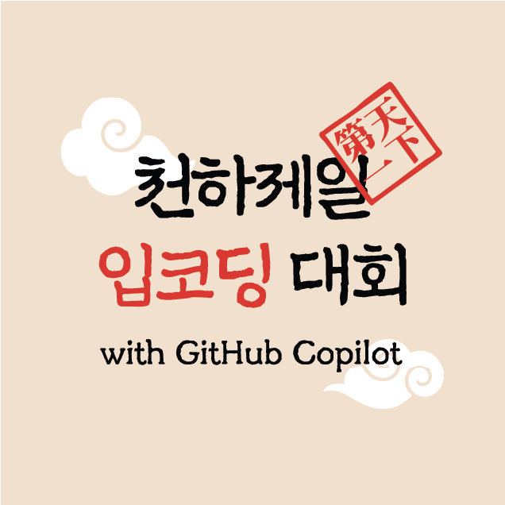

# 천하제일 입코딩 대회 2026

  

  
<strong>제 2회 천하제일 입코딩대회에 오신 것을 환영합니다!</strong>

## 행사 정보

자세한 행사 정보는 [https://lipcoding.kr](https://lipcoding.kr) 페이지를 참고하세요.

## 대회 방식

- 도전 과제: **개인 생산성 향상 앱**
- 제한 시간: 4시간
- 사용 도구:
  - VS Code + GitHub Copilot 보이스 코딩 또는 GitHub Copilot CLI + 보이스 코딩 플러그인
  - 운영체제 자체적으로 제공하는 음성 입력장치
- 기술 스택: 웹 앱
- 사용 언어: 자유 선택
- 배포 플랫폼: Azure 클라우드

## 시간 계획

| 시간          | 내용                              |
|---------------|-----------------------------------|
| 09:00 - 09:30 | 체크인                            |
| 09:30 - 09:40 | 오프닝                            |
| 09:40 - 10:20 | 오프닝 키노트                     |
| 10:20 - 10:30 | 도전 과제 세부 사항 및 심사 안내  |
| 10:30 - 11:30 | 입코딩 전 사전 준비 (키보드 허용) |
| 11:30 - 12:30 | 점심 식사                         |
| 12:30 - 16:30 | 입코딩                            |
| 16:30 - 17:30 | 심사 및 발표                      |
| 17:30 - 18:00 | 시상 및 클로징                    |

## 대회 전 사전 준비 사항

Discussions 보드의 [행사 참가를 위해 꼭 알고 있어야 할 내용입니다](https://github.com/lipcoding-kr/lipcoding-competition-2026/discussions/7) 포스트를 참고하세요.

[**내 GitHub 계정은 입코딩 대회에서 쓸 수 있을까?**](https://github.com/lipcoding-kr/lipcoding-competition-2026/discussions/9)

## 대회 규칙

- [입코딩 규칙](./policies/policy-rules.md)
- [페널티 규정](./policies/policy-penalties.md)

## 심사 항목

- [심사 항목](./judgements/judgement-criteria.md)

## 도전 과제

여러분은 **개인 생산성 향상 앱**을 만드는 것을 목표로 합니다. 아래 제약사항을 지켜 앱을 개발한 후 배포해 주세요.

- 주제: 개인 생산성 향상 앱
- 필수요소:
  - 반드시 웹 앱으로 개발할 것
  - 반드시 [Copilot SDK](https://github.com/github/copilot-sdk) 사용할 것
  - 반드시 Azure 플랫폼으로 배포할 것

## 팀 빌딩

앱 개발 후 제출을 위해서는 팀 빌딩이 필수적입니다. 팀은 단독으로 또는 최대 4명까지 만들 수 있습니다. 팀 빌딩 후 아래 링크를 통해 등록해 주세요.

팀 등록하기 👉 [https://lipcoding.kr/team-building](https://lipcoding.kr/team-building)

## 앱 제출

앱을 다 개발하셨으면 아래 링크를 통해 앱을 제출해 주세요.

앱 제출하기 👉 [https://lipcoding.kr/submissions](https://lipcoding.kr/submissions)

## 입상자 명단

TBD
