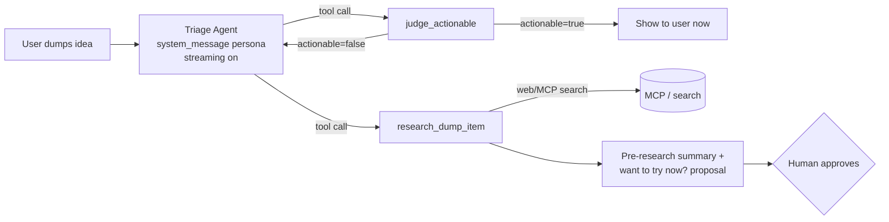

# Copilot SDK 사용법 조사

심사 가중치 최상위(25%). 앱의 핵심 가치가 여기서 나와야 한다.

출처: [.github/skills/copilot-sdk/SKILL.md](../../.github/skills/copilot-sdk/SKILL.md),
[.github/instructions/copilot-sdk-python.instructions.md](../../.github/instructions/copilot-sdk-python.instructions.md),
GitHub Docs(BYOK), Microsoft Learn(Azure OpenAI v1 API).

## 설치 + Hello World

SDK는 **Copilot CLI를 로컬 에이전트 서버로 구동**한다. BYOK를 써도 CLI가 PATH에 있어야 한다.

```bash
copilot --version              # GitHub Copilot CLI 설치 + 인증 필요
python --version               # 3.9+
pip install github-copilot-sdk # import 이름은 `copilot`
```

```python
import asyncio
from copilot import CopilotClient, PermissionHandler

async def main():
    async with CopilotClient() as client:          # CLI 서버 자동 기동
        session = await client.create_session({
            "on_permission_request": PermissionHandler.approve_all,
            "model": "gpt-4.1",
        })
        resp = await session.send_and_wait({"prompt": "What is 2 + 2?"})
        print(resp.data.content)

asyncio.run(main())
```

- `CopilotClient()` 가 CLI 서버를 자동 기동(`auto_start=True`), `async with` 로 정리.
- `send_and_wait(...)` 는 `session.idle` 까지 블록, `send(...)` 는 이벤트 기반 fire-and-forget.

## 4가지 필수 역량

### (a) 커스텀 툴

```python
from pydantic import BaseModel, Field
from copilot import define_tool

class JudgeArgs(BaseModel):
    idea: str = Field(description="The raw idea text the user dumped")

async def _judge(args, inv) -> dict:
    return {"actionable": True, "reason": "...", "confidence": 0.8}

judge_tool = define_tool(
    name="judge_actionable",
    description="Decide if an idea is actionable right now; return structured verdict.",
    parameters=JudgeArgs.model_json_schema(),
    handler=lambda args, inv: _judge(JudgeArgs(**args), inv),
)
```

핸들러 시그니처는 `(args: dict, invocation)`. `define_tool(name=, parameters=, handler=)`
명시적 호출 형태를 사용한다(Python instructions 문서 기준, 모호함 없음).

### (b) 툴을 호출하는 에이전트

"에이전트" = 페르소나(`system_message`) + 툴 세트를 가진 세션.

```python
session = await client.create_session({
    "on_permission_request": PermissionHandler.approve_all,
    "model": "gpt-4.1",
    "streaming": True,
    "tools": [judge_tool, research_tool],
    "system_message": {
        "mode": "append",   # 안전 가드레일 유지
        "content": "<role>You triage ideas. Call judge_actionable first. "
                   "If not actionable, call research_dump_item to pre-research.</role>",
    },
})
await session.send_and_wait({"prompt": "Idea: build a CLI that auto-tags my screenshots"})
```

`available_tools`(allowlist) / `excluded_tools`(blocklist) 로 세션별 툴 제약.

### (c) 스트리밍

`"streaming": True` + `session.on(handler)`. delta + final + idle 모두 처리.

```python
import asyncio
done = asyncio.Event()

def handler(event):
    if event.type == "assistant.message.delta":   # 토큰 증분
        print(event.data.delta_content, end="", flush=True)
    elif event.type == "tool.execution_start":
        ...
    elif event.type == "assistant.message":        # 최종(항상 옴)
        ...
    elif event.type == "session.idle":
        done.set()
    elif event.type == "session.error":
        done.set()

session.on(handler)
await session.send({"prompt": "..."})
await done.wait()
```

FastAPI 백엔드에서는 이걸 async generator(queue + `asyncio.Event`)로 감싸 SSE/WebSocket으로
브라우저에 토큰 스트리밍한다.

> ⚠️ **이벤트 이름 표기 불일치**: Python instructions는 점 표기(`assistant.message.delta`),
> 스킬 표는 언더스코어(`assistant.message_delta`). **첫 실행 때 `event.type` 를 출력해
> 설치 버전이 내보내는 이름으로 고정**한다. 안 맞으면 스트리밍이 조용히 동작 안 함.

### (d) Azure OpenAI / Foundry 백엔드 (BYOK — 18%)

`provider` 로 모델 계층을 오버라이드. **리소스 모양에 따라 두 가지:**

| 리소스 | `type` | `base_url` | 추가 |
|---|---|---|---|
| Native Azure OpenAI (`*.openai.azure.com`) | `"azure"` | 호스트만, `/openai/v1` 없음 | `"azure": {"api_version": "2024-10-21"}` |
| Foundry OpenAI 호환 (`/openai/v1/`) | `"openai"` | 풀 URL `.../openai/v1/` | `"wire_api": "responses"`(GPT-5) 또는 `"completions"` |

```python
import os
"provider": {                        # native Azure OpenAI
    "type": "azure",
    "base_url": "https://my-resource.openai.azure.com",   # 호스트만
    "api_key": os.environ["AZURE_OPENAI_API_KEY"],
    "azure": {"api_version": "2024-10-21"},
}
```

BYOK 제약: **API 키만(Entra ID 불가)**, `model` 필수(=배포 이름), rate limit은 본인 Azure 리소스 것.

## 두 핵심 역량을 SDK 툴로 모델링

깊이 점수(25%)를 극대화하는 구조 = **오케스트레이터 에이전트(스트리밍) + 툴 2개**.
하나는 중첩 모델 호출로 추론, 다른 하나는 MCP로 실제 리서치.



**`judge_actionable(idea)`** — 동기 + 스트리밍(사용자가 추론을 실시간으로 봄)
- 반환: `{ actionable, reason, confidence, missing_prereqs, suggested_first_step }`.
- 구현: ① 핸들러 내 결정적 휴리스틱(빠름·저비용), 또는 ② 중첩 모델 호출(엄격한 judge
  프롬프트 + JSON 출력) → 깊이 어필. 데모 최적화용으로 ②, 단 캐시/타임아웃.

**`research_dump_item(idea)`** — 비동기/백그라운드(UI 블로킹 없음)
- 하드코딩 대신 **MCP 서버**(웹 검색 / GitHub MCP) 호출로 툴콜 깊이 + 클라우드 연관성 강화:
  ```python
  "mcp_servers": {"github": {"type": "http", "url": "https://api.githubcopilot.com/mcp/"}}
  ```
- 반환: `{ summary, sources, proposed_action, ready_to_try }`. 저장 후 나중에
  "지금 해볼까요?"를 **사람 승인**으로 노출 → Responsible-AI 6%도 함께 득점.
- `"mode": "enqueue"` 로 백그라운드 실행.

## 이름 / 환경변수 / 검증 스켈레톤

| 항목 | 값 |
|---|---|
| 언어 | Python 3.9+ (전체 async/await) |
| pip | `github-copilot-sdk` |
| import | `from copilot import CopilotClient, PermissionHandler, define_tool` |
| 파라미터 모델 | `pydantic` (`.model_json_schema()`) |
| 외부 의존 | GitHub **Copilot CLI** PATH 등록 (`copilot --version`) |
| 환경(Azure) | `AZURE_OPENAI_API_KEY`, `AZURE_OPENAI_ENDPOINT`(호스트), `AZURE_OPENAI_API_VERSION`(`2024-10-21`), 배포 이름=`model` |
| secret | env로만 읽기, 하드코딩 금지. 로컬 `.env`+`python-dotenv`, 배포는 secret 스토어 |

```python
import asyncio, os
from copilot import CopilotClient, PermissionHandler

async def main():
    async with CopilotClient() as client:
        session = await client.create_session({
            "on_permission_request": PermissionHandler.approve_all,
            "model": os.environ.get("AZURE_OPENAI_DEPLOYMENT", "gpt-4.1"),
            "provider": {
                "type": "azure",
                "base_url": os.environ["AZURE_OPENAI_ENDPOINT"],
                "api_key": os.environ["AZURE_OPENAI_API_KEY"],
                "azure": {"api_version": os.environ.get("AZURE_OPENAI_API_VERSION", "2024-10-21")},
            },
        })
        r = await session.send_and_wait({"prompt": "Reply with exactly: OK"})
        print("MODEL SAID:", r.data.content)

asyncio.run(main())
```

이게 `OK` 를 출력하면 CLI 인증 + SDK 배선 + Azure provider가 전부 정상.

## 함정

- **테크니컬 프리뷰** — 파괴적 변경 가능. SDK/CLI 버전 **핀 고정** 후 리포 메모리에 기록.
- **CLI는 하드 의존** — 배포 컨테이너에서도 설치+인증, 또는 `copilot --server --port 4321`
  서버 모드로 띄우고 `{"cli_url": "localhost:4321"}` 로 연결.
- **이벤트 이름 드리프트** — `event.type` 한 번 찍어 고정(위 ⚠️).
- **BYOK는 `model` 필수** — 빼면 "Model not specified".
- **Azure 엔드포인트 타입 혼동** — `type:"azure"`=호스트만(SDK가 경로 추가),
  `type:"openai"`=`/openai/v1/` 직접 포함. 섞으면 실패.
- **Rate limit은 본인 리소스 것** — S0/저 TPM은 judge+research 중첩 시 429.
  judge 프롬프트 짧게, 타임아웃, 백그라운드 리서치 직렬화.
- **`wire_api`** — GPT-5/추론 모델 `"responses"`, 구형 `"completions"`.
- **권한** — 데모는 `approve_all` 가능하나, "지금 해볼까요?"는 명시적 사람 승인 뒤에 둘 것(6%).

## 먼저 할 일 (순서)

1. `copilot --version` → 없으면 CLI 설치/인증.
2. `pip install github-copilot-sdk pydantic python-dotenv` (SDK 버전 핀).
3. `AZURE_OPENAI_ENDPOINT`, `AZURE_OPENAI_API_KEY`, 배포 이름 설정.
4. 위 검증 스켈레톤 실행 → Azure 경유 `OK` 확인.
5. `streaming:True` 로 `event.type` 한 번 출력 → delta/idle 이벤트 이름 고정.
6. `judge_actionable` 추가(결정적 먼저, 중첩 모델 나중) → 툴콜 발화 확인.
7. `research_dump_item` + MCP 서버 1개 → 백그라운드 리서치가 sources 반환 확인.
8. 스트리밍을 async generator로 감싸 FastAPI SSE/WebSocket 엔드포인트에 연결.
