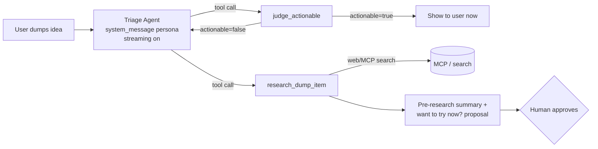

# Copilot SDK Usage Research

Top scoring weight (25%). The app's core value must come from here.

Sources: [.github/skills/copilot-sdk/SKILL.md](../../.github/skills/copilot-sdk/SKILL.md),
[.github/instructions/copilot-sdk-python.instructions.md](../../.github/instructions/copilot-sdk-python.instructions.md),
GitHub Docs (BYOK), Microsoft Learn (Azure OpenAI v1 API).

## Installation + Hello World

The SDK **runs the Copilot CLI as a local agent server**. Even with BYOK, the CLI must be in PATH.

```bash
copilot --version              # GitHub Copilot CLI must be installed + authenticated
python --version               # 3.9+
pip install github-copilot-sdk # import name is `copilot`
```

```python
import asyncio
from copilot import CopilotClient, PermissionHandler

async def main():
    async with CopilotClient() as client:          # CLI server auto-starts
        session = await client.create_session({
            "on_permission_request": PermissionHandler.approve_all,
            "model": "gpt-4.1",
        })
        resp = await session.send_and_wait({"prompt": "What is 2 + 2?"})
        print(resp.data.content)

asyncio.run(main())
```

- `CopilotClient()` auto-starts the CLI server (`auto_start=True`), cleaned up via `async with`.
- `send_and_wait(...)` blocks until `session.idle`; `send(...)` is event-based fire-and-forget.

## Four Essential Capabilities

### (a) Custom Tools

```python
from pydantic import BaseModel, Field
from copilot import define_tool

class JudgeArgs(BaseModel):
    idea: str = Field(description="The raw idea text the user dumped")

async def _judge(args, inv) -> dict:
    return {"actionable": True, "reason": "...", "confidence": 0.8}

judge_tool = define_tool(
    name="judge_actionable",
    description="Decide if an idea is actionable right now; return structured verdict.",
    parameters=JudgeArgs.model_json_schema(),
    handler=lambda args, inv: _judge(JudgeArgs(**args), inv),
)
```

Handler signature is `(args: dict, invocation)`. Use `define_tool(name=, parameters=, handler=)`
explicit call form (per Python instructions doc, no ambiguity).

### (b) Agent Calling Tools

"Agent" = a session with a persona (`system_message`) + tool set.

```python
session = await client.create_session({
    "on_permission_request": PermissionHandler.approve_all,
    "model": "gpt-4.1",
    "streaming": True,
    "tools": [judge_tool, research_tool],
    "system_message": {
        "mode": "append",   # keep safety guardrails
        "content": "<role>You triage ideas. Call judge_actionable first. "
                   "If not actionable, call research_dump_item to pre-research.</role>",
    },
})
await session.send_and_wait({"prompt": "Idea: build a CLI that auto-tags my screenshots"})
```

Use `available_tools` (allowlist) / `excluded_tools` (blocklist) to constrain tools per session.

### (c) Streaming

`"streaming": True` + `session.on(handler)`. Handle delta + final + idle.

```python
import asyncio
done = asyncio.Event()

def handler(event):
    if event.type == "assistant.message.delta":   # token increment
        print(event.data.delta_content, end="", flush=True)
    elif event.type == "tool.execution_start":
        ...
    elif event.type == "assistant.message":        # final (always arrives)
        ...
    elif event.type == "session.idle":
        done.set()
    elif event.type == "session.error":
        done.set()

session.on(handler)
await session.send({"prompt": "..."})
await done.wait()
```

In a FastAPI backend, wrap this in an async generator (queue + `asyncio.Event`) to stream
tokens to the browser via SSE/WebSocket.

> ⚠️ **Event name inconsistency**: Python instructions use dot notation (`assistant.message.delta`),
> skill table uses underscores (`assistant.message_delta`). **Print `event.type` on first run and
> fix to whatever name your installed version emits.** Mismatch = streaming silently does nothing.

### (d) Azure OpenAI / Foundry Backend (BYOK — 18%)

Override the model layer with `provider`. **Two variants depending on resource type:**

| Resource | `type` | `base_url` | Extra |
|---|---|---|---|
| Native Azure OpenAI (`*.openai.azure.com`) | `"azure"` | Host only, no `/openai/v1` | `"azure": {"api_version": "2024-10-21"}` |
| Foundry OpenAI-compatible (`/openai/v1/`) | `"openai"` | Full URL `.../openai/v1/` | `"wire_api": "responses"` (GPT-5) or `"completions"` |

```python
import os
"provider": {                        # native Azure OpenAI
    "type": "azure",
    "base_url": "https://my-resource.openai.azure.com",   # host only
    "api_key": os.environ["AZURE_OPENAI_API_KEY"],
    "azure": {"api_version": "2024-10-21"},
}
```

BYOK constraints: **API key only (Entra ID not supported)**, `model` required (= deployment name),
rate limits are your Azure resource's limits.

## Modeling Two Core Capabilities as SDK Tools

Structure to maximize depth score (25%) = **orchestrator agent (streaming) + 2 tools**.
One uses nested model calls for reasoning, the other uses MCP for real research.



**`judge_actionable(idea)`** — synchronous + streaming (user sees reasoning in real time)
- Returns: `{ actionable, reason, confidence, missing_prereqs, suggested_first_step }`.
- Implementation: ① deterministic heuristic in handler (fast, cheap), or ② nested model call
  (strict judge prompt + JSON output) → deeper score. Use ② for demo optimization, with cache/timeout.

**`research_dump_item(idea)`** — async/background (no UI blocking)
- Call **MCP servers** (web search / GitHub MCP) instead of hardcoding to add tool-call depth + cloud relevance:
  ```python
  "mcp_servers": {"github": {"type": "http", "url": "https://api.githubcopilot.com/mcp/"}}
  ```
- Returns: `{ summary, sources, proposed_action, ready_to_try }`. Store, then expose "want to try now?"
  as **human approval** → earns Responsible AI 6% score too.
- Run in background with `"mode": "enqueue"`.

## Names / Env Vars / Verification Skeleton

| Item | Value |
|---|---|
| Language | Python 3.9+ (full async/await) |
| pip | `github-copilot-sdk` |
| import | `from copilot import CopilotClient, PermissionHandler, define_tool` |
| Parameter model | `pydantic` (`.model_json_schema()`) |
| External dependency | GitHub **Copilot CLI** in PATH (`copilot --version`) |
| Environment (Azure) | `AZURE_OPENAI_API_KEY`, `AZURE_OPENAI_ENDPOINT` (host), `AZURE_OPENAI_API_VERSION` (`2024-10-21`), deployment name = `model` |
| Secrets | Read via env only, never hardcode. Local `.env`+`python-dotenv`, production uses secret store |

```python
import asyncio, os
from copilot import CopilotClient, PermissionHandler

async def main():
    async with CopilotClient() as client:
        session = await client.create_session({
            "on_permission_request": PermissionHandler.approve_all,
            "model": os.environ.get("AZURE_OPENAI_DEPLOYMENT", "gpt-4.1"),
            "provider": {
                "type": "azure",
                "base_url": os.environ["AZURE_OPENAI_ENDPOINT"],
                "api_key": os.environ["AZURE_OPENAI_API_KEY"],
                "azure": {"api_version": os.environ.get("AZURE_OPENAI_API_VERSION", "2024-10-21")},
            },
        })
        r = await session.send_and_wait({"prompt": "Reply with exactly: OK"})
        print("MODEL SAID:", r.data.content)

asyncio.run(main())
```

If this prints `OK`, CLI auth + SDK wiring + Azure provider are all working.

## Pitfalls

- **Technical preview** — breaking changes possible. **Pin** SDK/CLI versions and record in repo memory.
- **CLI is a hard dependency** — install + auth in production containers too, or run `copilot --server --port 4321`
  in server mode and connect with `{"cli_url": "localhost:4321"}`.
- **Event name drift** — print `event.type` once and fix (see ⚠️ above).
- **BYOK requires `model`** — omitting it gives "Model not specified".
- **Azure endpoint type confusion** — `type:"azure"` = host only (SDK appends the path);
  `type:"openai"` = include `/openai/v1/` directly. Mixing them causes failures.
- **Rate limits are your resource's limits** — low TPM S0 can 429 on judge+research concurrency.
  Keep judge prompt short, add timeout, serialize background research.
- **`wire_api`** — GPT-5/reasoning models use `"responses"`, older models use `"completions"`.
- **Permissions** — `approve_all` is fine for demos, but "want to try now?" must be behind explicit
  human approval (earns 6%).

## Steps to Do First (in order)

1. `copilot --version` → install/auth CLI if missing.
2. `pip install github-copilot-sdk pydantic python-dotenv` (pin SDK version).
3. Set `AZURE_OPENAI_ENDPOINT`, `AZURE_OPENAI_API_KEY`, deployment name.
4. Run verification skeleton above → confirm Azure-routed `OK`.
5. Add `streaming:True`, print `event.type` once → fix delta/idle event names.
6. Add `judge_actionable` (deterministic first, nested model later) → confirm tool call fires.
7. Add `research_dump_item` + 1 MCP server → confirm background research returns sources.
8. Wrap streaming in async generator for FastAPI SSE/WebSocket endpoint.
